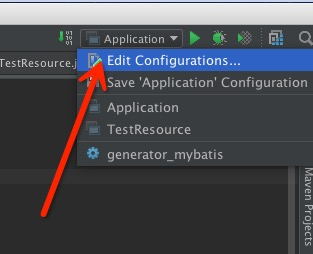

##自动生成mybatis代码

####step1:
在maven项目的pom.xml 添加mybatis-generator-maven-plugin 插件
    
- 复杂   
````xml
<plugin>
    <groupId>org.mybatis.generator</groupId>
    <artifactId>mybatis-generator-maven-plugin</artifactId>
    <version>1.3.2</version>
    <configuration>
        <configurationFile>src/main/resources/mybatis-generator/generatorConfig.xml</configurationFile>
        <verbose>true</verbose>
        <overwrite>true</overwrite>
    </configuration>
    <executions>
        <execution>
            <id>Generate MyBatis Artifacts</id>
            <goals>
                <goal>generate</goal>
            </goals>
        </execution>
    </executions>
    <dependencies>
        <dependency>
            <groupId>org.mybatis.generator</groupId>
            <artifactId>mybatis-generator-core</artifactId>
            <version>1.3.2</version>
        </dependency>
    </dependencies>
</plugin>
````

- 简单
````xml
  <build>
    <finalName>xxx</finalName>
    <plugins>
      <plugin>
        <groupId>org.mybatis.generator</groupId>
        <artifactId>mybatis-generator-maven-plugin</artifactId>
        <version>1.3.2</version>
        <configuration>
          <verbose>true</verbose>
          <overwrite>true</overwrite>
        </configuration>
      </plugin>
    </plugins>
  </build>
````

复杂版本可以值定generatorConfig.xml位置，而简单版本使用默认路径，默认路径为src/main/resources

####step2：
使用step1简单版本，在maven项目下的src/main/resources 目录下建立名为 generatorConfig.xml的配置文件，作为mybatis-generator-maven-plugin 插件的执行目标 
````xml
<?xml version="1.0" encoding="UTF-8" ?>
<!DOCTYPE generatorConfiguration PUBLIC "-//mybatis.org//DTD MyBatis Generator Configuration 1.0//EN"
        "http://mybatis.org/dtd/mybatis-generator-config_1_0.dtd" >
<generatorConfiguration>
    <classPathEntry
            location="/Users/kk/.m2/repository/mysql/mysql-connector-java/5.1.35/mysql-connector-java-5.1.35.jar"/>
    <context id="context1">
        <commentGenerator>
            <property name="suppressDate" value="true"/>
            <!-- 是否去除自动生成的注释 true：是 ： false:否 -->
            <property name="suppressAllComments" value="true"/>
        </commentGenerator>

        <!--数据库链接URL，用户名、密码 -->
        <jdbcConnection driverClass="com.mysql.jdbc.Driver" connectionURL="jdbc:mysql://192.168.99.100:3306/hjtms"
                        userId="root" password="root"/>
        <!-- 生成模型的包名和位置-->
        <javaModelGenerator targetPackage="com.ricky.clothes.model" targetProject="src/main/java"/>
        <!-- 生成映射文件的包名和位置-->
        <sqlMapGenerator targetPackage="com.ricky.clothes.mapper.impl" targetProject="src/main/resources"/>
        <!-- 生成DAO的包名和位置-->
        <javaClientGenerator targetPackage="com.ricky.clothes.mapper" targetProject="src/main/java" type="XMLMAPPER"/>

        <!-- 要生成哪些表-->
        <table tableName="hjtms_task" domainObjectName="Task" enableCountByExample="false" enableUpdateByExample="false"
               enableDeleteByExample="false" enableSelectByExample="false" selectByExampleQueryId="false"></table>
    </context>
</generatorConfiguration>
````

####setp3: 
添加Maven启动,Intellij右上角：



